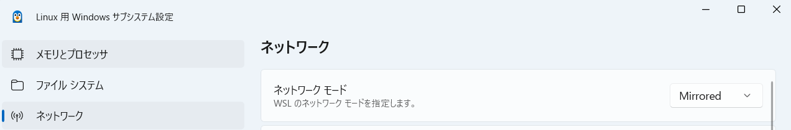
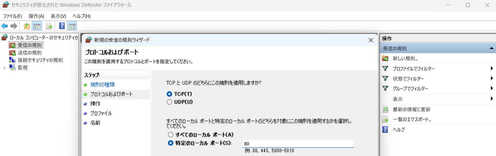
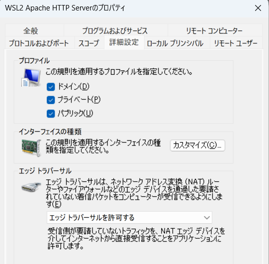
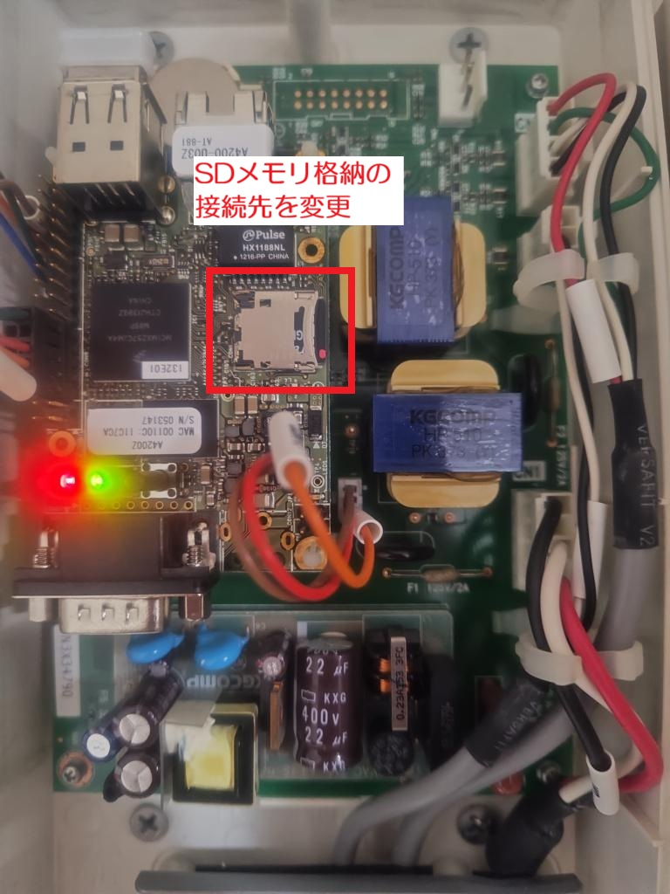

# sfmon
ソーラーフロンティアモニター ホームサーバダイレクトリアルタイム表示
==================

## About sfmon
ソーラーフロンティアモニターのリアルタイム表示をホームサーバーより直接取得しWeb表示します。  
2025/12 サービス停止に伴い、従来ソーラーフロンティアへ送信していた10分毎の積算値csvデータを受信する機能追加しました。

ホームサーバー, SF2MHS-1001  

ソーラーフロンティア製  
終了したフロンティアモニター ホームエネルギーモニタリングサービス  
リアルタイム表示部分の代替機能になります。  
※HTMLのみ版とJQuery版の２種あり

## Usage

■実行環境  
* Apache mod_wsgi  
* Python3  

------------------------------------------------
# Windows11での環境構築例：  
Linux（ubuntu）環境のインストール  

PowerShellにて以下を実行  
<pre>
> wsl --install
</pre>

※外部からアクセス可能にするため以下設定  

WSLのネットワークモードがMirrored  

  
「セキュリティが強化されたWindows Defender ファイアウォール」を開き、「受信の規則」から「新しい規則」を作成  
「ポート」を選んで、TCPプロトコルで「特定のローカルポート」に「80」と入力後、  
「接続を許可する」を選んで名前を付けて保存、詳細設定で「エッジトラバーサルを許可する」設定を行う  

  
------------------------------------------------
# Linux（ubuntu）環境のWebサーバ設定

Apache Webサーバのインストール  
<pre>
$ sudo apt install apache2
$ sudo apt install libapache2-mod-wsgi-py3
</pre>

------------------------------------------------
# mod_wsgiの設定をインストール

<pre>
定義をコピー
$ sudo cp wsgi.conf /etc/apache2/conf-available/.

定義を有効化
$ sudo a2enconf wsgi
$ sudo systemctl reload apache2
</pre>

------------------------------------------------
# ホームサーバのIPアドレス設定
app.wsgi, appjq.wsgiの最初の行へホームサーバのIPアドレスを設定する
<pre>
IP_ADDRESS='192.168.0.xxx'
</pre>

※ホームサーバやルータの設定でIPアドレス固定にしておくと良いです。

------------------------------------------------
# ホームサーバの接続先設定

太陽光側ブレーカーを落として電源OFF確認し

以下のmicro sdメモリを取外して接続先をPCへ設定変更  

SDメモリ内の
config\center.ini  
修正前
<pre>
[NETWORK]
DataCenter=https://www.frontier-monitor.com/
（省略）
</pre>

修正後
<pre>
[NETWORK]
DataCenter=http://192.168.0.(Linux環境PCアドレス)/
（省略）
</pre>

micro sdメモリを元に戻したあと、太陽光側ブレーカーを上げて電源ON  
ホームサーバーへログインし未通知情報を確認してSDメモリ認識エラーが無いことを確認

------------------------------------------------
コンテンツのインストール
<pre>
$ sudo cp -r csv css images /var/www/html/
$ sudo cp -r wsgi /var/www/
$ sudo chown -R www-data:www-data /var/www/html/csv
</pre>
※csvフォルダを書き込み可能にする

------------------------------------------------
# 格納場所確認

<pre>
$ tree /var/www/
/var/www/
├── html
│   ├── csv
│   │   └── sfmonitor.csv
│   ├── css
│   │   └── rt_import.css
│   ├── images
│   │   ├── auto_off.png
│   │   ├── auto_on.png
│   │   ├── common
│   │   │   └── pop_bg.jpg
│   │   └── manu_in.png
│   └── index.html
└── wsgi
    ├── app.wsgi
    └── appjq.wsgi
</pre>

以下にアクセスして表示されればOK  
HTMLのみ版  
<http://localhost/py>  

JQuery版  
<http://localhost/jq>  

 
# 10分毎の積算値csvデータ

10分毎の積算値csvデータ  
<http://localhost/csv/sfmonitor.csv>  

例
<pre>
SF,K00000B000001,192.168.0.41,0030;3011;,,,,,V104,202601101150,600,00,255.16,21.80,0.00,1540.79,101.5,101.1,101.8,101.3,100.8,101.8,4.52,2.31,D,D,D,D,O,,,,
SF,K00000B000001,192.168.0.41,0030;3011;,,,,,V104,202601101200,600,00,255.51,24.17,0.00,1541.19,101.5,101.0,102.1,101.4,100.8,101.9,4.82,2.41,D,D,D,D,O,,,,
SF,K00000B000001,192.168.0.41,0030;3011;,,,,,V104,202601101210,600,00,255.29,19.92,0.00,1545.37,101.7,101.2,102.1,101.3,100.9,101.8,4.47,2.24,D,D,D,D,O,,,,

[0]列：SF
（省略）
[9]列：年月日時分
[12]列：発電量W
[13]列：売電量W
[14]列：買電量W
[15]列：最大値W
</pre>

