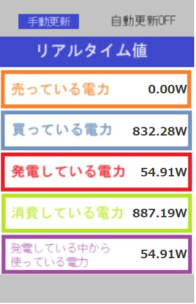

# sfmon
ソーラーフロンティアモニター ホームサーバダイレクトリアルタイム表示
==================

## About sfmon
ソーラーフロンティアモニターのリアルタイム表示をホームサーバーより直接取得しWeb表示します。

ホームサーバー, SF2MHS-1001  
<https://www.solar-frontier.com/jpn/products/manual.html>

ソーラーフロンティア  
フロンティアモニター ホームエネルギーモニタリングサービス  
リアルタイム表示部分の代替機能になります。  
<https://www.frontier-monitor.com/persite/top>

## Usage

■実行環境  
* Apache mod_wsgi  
* Python3  

------------------------------------------------
# Windows11での環境構築例：  

Linux（ubuntu）環境のインストール  

PowerShellにて以下を実行  
> wsl --install

Apache Webサーバのインストール
<pre>
$ sudo apt install apache2
$ sudo apt install libapache2-mod-wsgi-py3
</pre>

------------------------------------------------
# mod_wsgiの設定をインストール

<pre>
定義をコピー
$ sudo cp wsgi.conf /etc/apache2/conf-available/.

定義を有効化
$ a2enconf wsgi
$ systemctl reload apache2
</pre>

------------------------------------------------
# ホームサーバのIPアドレス設定
app.wsgiの最初の行へホームサーバのIPアドレスを設定する
<pre>
IP_ADDRESS='192.168.0.xxx'
</pre>

※ホームサーバやルータの設定でIPアドレス固定にしておくと良いです。

------------------------------------------------
コンテンツのインストール
<pre>
$ sudo cp -r css images /var/www/html/
$ sudo cp -r wsgi /var/www/
</pre>

------------------------------------------------
# 格納場所確認

<pre>
$ tree /var/www/
/var/www/
├── html
│   ├── css
│   │   └── rt_import.css
│   ├── images
│   │   ├── auto_off.png
│   │   ├── auto_on.png
│   │   ├── common
│   │   │   └── pop_bg.jpg
│   │   └── manu_in.png
│   └── index.html
└── wsgi
    └── app.wsgi
</pre>

以下にアクセスして表示されればOK  

<http://localhost/py>

------------------------------------------------
おまけ：画像ファイルの差し替え
フロンティアモニターにログインして以下画像をダウンロードして差し替えれば、見慣れた表示になります。  

<https://www.frontier-monitor.com/persite/images/common/pop_bg.jpg>  
<https://www.frontier-monitor.com/persite/images/manu_in.png>  
<https://www.frontier-monitor.com/persite/images/auto_on.png>  
<https://www.frontier-monitor.com/persite/images/auto_off.png>  

